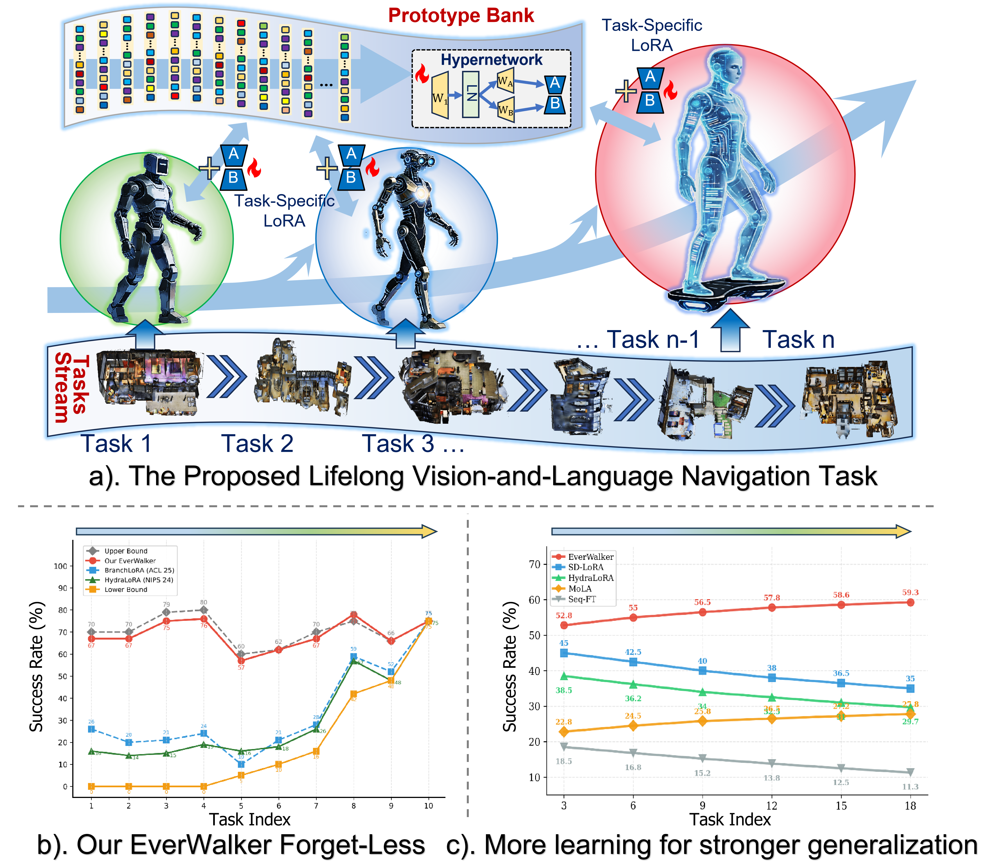
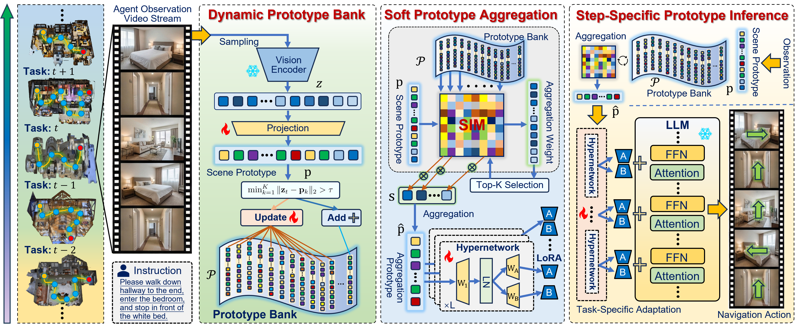

# Evolving the Prototype Journey: Lifelong Vision-and-Language Navigation with Prototype Adaptation

<p align="center">
  <b>🎉 Accepted by IEEE Transactions on Circuits and Systems for Video Technology (T-CSVT)</b>
</p>

<p align="center">
  <a href="https://doi.org/10.1109/TCSVT.2026.3727681"></a>
  &nbsp;&nbsp;&nbsp;&nbsp;
  <a href="https://ganvin-li.github.io/EverWalker/"></a>
  &nbsp;&nbsp;&nbsp;&nbsp;
  <a href="LICENSE"></a>
  &nbsp;&nbsp;&nbsp;&nbsp;
  <a href="https://github.com/Ganvin-Li/EverWalker/stargazers"></a>
</p>

---

<div align="center">

</div>


---

## 📌 Overview

**EverWalker** is a novel framework for **lifelong vision-and-language navigation (LVLN)** that enables navigation agents to continually learn new tasks without catastrophic forgetting. Our method achieves state-of-the-art performance through three key innovations:

<div align="center">

<p><i>ProtoStream enables lifelong learning across diverse navigation scenes and instruction styles</i></p>
</div>

- 🧩 **Dynamic Prototype Bank**: Automatically grows to capture scene knowledge with soft routing mechanism
- 🔧 **HyperNetwork**: Generates step-level LoRA adaptations conditioned on weighted prototypes
- 🎯 **Multi-Level Distillation**: Novel HyperNet output distillation to prevent both prototype drift and mapping instability


---

## ✨ Key Features

### Lifelong Learning without Forgetting
- ✅ **Low forgetting rate**
- ✅ **High average success rate** across continual tasks
- ✅ **Strong zero-shot generalization** to unseen scenes

### Efficient and Scalable
- ⚡ **Computational overhead**: Minimal additional cost
- 🔄 **Dynamic adaptation**: Step-level LoRA generation

### Comprehensive Framework
- 🎓 Based on StreamVLN with Qwen-7B backbone
- 🏗️ Modular design: Easy to extend and customize
- 📊 Complete evaluation suite with multiple metrics

---

## 🏗️ Architecture

### System ComponentsKey Innovations

**1. Dynamic Prototype Bank**

```python
# Soft routing over ALL prototypes (not top-k)
similarities = cosine_similarity(z_t, prototypes)  
weights = softmax(similarities / temperature)       
weighted_proto = sum(weights * prototypes)         
```

**2. HyperNetwork Design**

```python
# Step-level LoRA generation
for layer_size in unique_sizes:
    lora_A = generator_A(weighted_proto)
    lora_B = generator_B(weighted_proto)
```

**3. Multi-Level Distillation**
```python
# Complete distillation chain
L_total = L_task
        + λ_sp * L_sp
        + λ_pp * L_pp
        + λ_cp * L_cp
        + λ_lora * L_lora
        + λ_div * L_div
```

---

## 🚀 Getting Started

### Prerequisites

- Python 3.8+
- PyTorch 2.0+
- CUDA 11.7+ (for GPU support)
- 8× NVIDIA A6000 GPUs (or equivalent, 48GB VRAM each)

### Installation

```bash
# Clone the repository
git clone https://github.com/Lifelong-EverWalker/EverWalker.git
cd EverWalker

# Create conda environment
conda create -n protostream python=3.8
conda activate EverWalker

# Install dependencies
pip install -r requirements.txt

# Install habitat-sim (for VLN simulation)
conda install habitat-sim -c conda-forge -c aihabitat
```

### Quick Start

#### 1. Prepare Data

```bash
# Download StreamVLN dataset
python scripts/download_dataset.py

# Preprocess data
python scripts/preprocess_data.py
```

#### 2. Train EverWalker

```bash
# Single GPU training (for debugging)
python streamvln_train.py \
    --config config/vln_r2r.yaml \
    --use_protostream \
    --output_dir outputs/protostream_debug

# Multi-GPU training (recommended)
bash scripts/streamvln_train_protostream.sh
```

#### 3. Evaluate

```bash
# Evaluate on all tasks
python streamvln_eval.py \
    --checkpoint outputs/protostream/checkpoints \
    --config config/vln_r2r.yaml \
    --output_dir outputs/evaluation
```

---

## 📖 Citation

If you find our work useful in your research, please consider citing:

```bibtex
@ARTICLE{11667662,
  author={Li, Gan and Wang, Xudong and Liao, Yue and Lv, Xuewei and Dong, Jiahua and Liu, Xiyao and Wang, Yanbo and Qin, Pinle and Liu, Lianqing and Han, Zhi},
  journal={IEEE Transactions on Circuits and Systems for Video Technology}, 
  title={Evolving the Prototype Journey: Lifelong Vision-and-Language Navigation with Prototype Adaptation}, 
  year={2026},
  volume={},
  number={},
  pages={1-1},
  keywords={Vision-and-language navigation;continual learning;robotic learning;embodied AI},
  doi={10.1109/TCSVT.2026.3727681}}
```